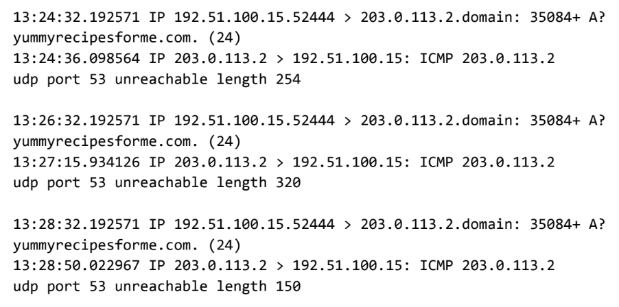

# Analyze network layer communication

Scenario:

 You are a cybersecurity analyst working at a company that specializes in providing IT consultant services. Several customers contacted your company to report that they were not able to access the company website www.yummyrecipesforme.com, and saw the error “destination port unreachable” after waiting for the page to load. 

You are tasked with analyzing the situation and determining which network protocol was affected during this incident. To start, you visit the website and you also receive the error “destination port unreachable.” Next, you load your network analyzer tool, tcpdump, and load the webpage again. This time, you receive a lot of packets in your network analyzer. The analyzer shows that when you send UDP packets and receive an ICMP response returned to your host, the results contain an error message: “udp port 53 unreachable.” 

- [Botium Toys: Scope, goals, and risk assessment report] 
- [Botium Toys: Control assessment report](https://docs.google.com/document/d/1u9gcwUDiHzHZK-toWVk_taZ94lkLqC23FOUNULjwQNQ/edit?usp=sharing)
- [Botium Toys:Compliance checklist](https://docs.google.com/document/d/14DRAJoGtJx1Uf4qH0zTevN8-M_btZeh2darW5X1sXxA/edit?usp=sharing&resourcekey=0-0NNiC-_oWRzpGPXnUg0ctw)
- [Botium Toys: Stakeholders Memorandum](https://docs.google.com/document/d/1Cgq3laOz9A5rpC1ipIu5Pe1t2Jq1NjpemVLdROyecto/edit?usp=sharing)
<h1></h1>
